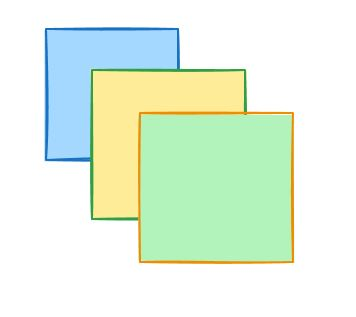
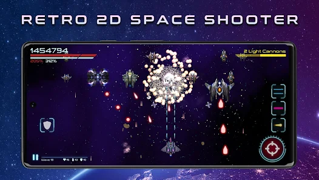

# PITSI306-positions

## 1.

```css
text-align:center;
padding-top:calc(50%-.5em);
```

## 2.

```css
position:absolute;
top:50%;
left:50%;
translate:-50% -50%;
```

## 3. (for container)
```css
display:flex;
justify-content:center;
align-items:center;
```
## 4. (for container)
```css
display:grid;
place-items:center;
```

#### ZAD.30601
Przygotuj prostokątne elementy (nachodzące na siebie). Po kliknięciu na element przenoszony jest "na górę";



#### ZAD 30602
Przygotuj mockup ekranu gry 2D "Retro space shooter" w HTML i CSS zawierający osobne elementy UI
- player
- Punkty
- Życie
- Broń
- Sterowanie



